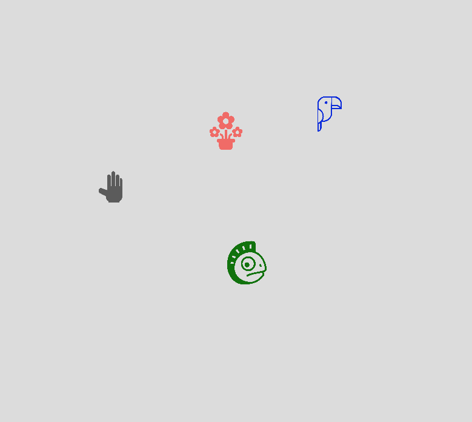
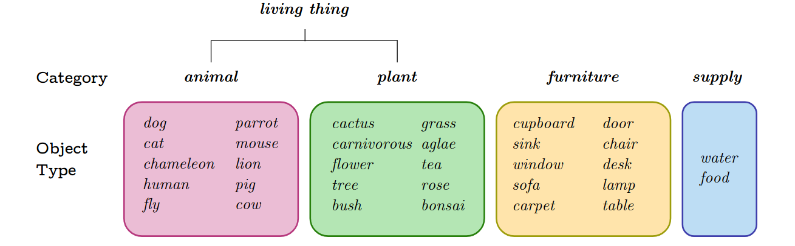

# Playground Env

The *Playground* environment is designed **to study systematic generalization in language-conditioned RL agents**. The agent evolves in 2D scene with procedurally-generated objects that are characterized by their color (rgb), size, type and category. It is made easy to add more objects, categories, attributes, to add object- or category-specific interactions, goal descriptions, etc. One defining feature of *Playground* is that it separates the study of systematic generalization from the study of exploration, by reducing the need for efficient navigation exploration (2D world, with close-by objects). However, this does not turn *Playground* into a toy problem. The number of goal descriptions can easily be extended by adding more objects, attributes, cateogries, synonyms, etc. Each scene can sample a different number of objects, and they are procedurally generated (continuous size, color and position). The problem can be made arbitrarily complicated for the agent to understand goals, and learn to achieve them using the right objects. It simply removes the extra burden of exploratory-demanding navigation.

In the current version from the the [Language as a Cognitive Tool to Imagine Goals in Curiosity-Driven Exploration](https://arxiv.org/pdf/2002.09253.pdf) paper, the agent can navigate in 2D, grasp and move objects. In this paper, we study 5 types of generalization, including generalization to new combination of object and attribute (e.g. grasp red cat); the transfer of knowledge from one predicate to the other (e.g. understanding to grow plants from grasping plants);   or category understanding (e.g. understanding which objects are animals from 'grow any cat', 'grow any dog' and 'grow any animal' goals and transferring this knowledge to 'grasp any animal'), see the paper for detailed explanations.

 <em>The Playground environment, with three objects.</em>

**The agent**
The agent is materialized by a circle (represented by the hand). It can move in 2D directions and grasp/release (3 actions).

**Objects**
Objects are represented by their type (one-hot encoding), their position (2D), their color (rgb code), their size (1D) and whether they are grasped or not (Boolean). When using 
language, they can be referred to by any of their attributes (e.g. color, size, type etc.). The image below lists all already implemented objects.

 <em>Objects already implemented in Playground.</em>

**Admissible actions**
In the current version, the agent can navigate the 2D space (Move), grasp objects (Grasp) and grow some of them (Grow). Only animals and plants (living_things) objects can be 
grown. Animals can be grown with water or food objects, while plants can only be grown with water.

**Attributes**
The Playground environment implements several attributes:
* Type: each object has a type (e.g. dog, cactus, door, etc)
* Category: each object belong to one or several categories (e.g. dogs are animals and living\_things, doors are furniture, etc).
* Color: each object can have one of three colors (red, blue, green).
* Shade: each object can have a shade (in addition to the color), light or dark.
* Position: each object can be referred to by its position (left, right, top, bottom) depending on the quadrant it is located in.
* Size: each object can be referred to by its size (big or small).
* Relative shade: an object can be the darkest / lightest.
* Relative position: an object can be the leftest, rightest, highest or lowest.
* Relative size: an object can be the biggest or smallest.
Playground proposes a set of functions to extract an object's attributes as a function of its features and others objects' features.

**Parameters**
The current version of Playground allows to tune some parameters:
* The maximum number of objects (max_nb_objects)
* Whether the number of objects changes (random_nb_objects, bool)
* Admissible actions in ('Move', 'Grasp', 'Grow')
* Admissible attributes in ('colors', 'categories', 'types'),#, 'relative_sizes', 'shades', 'relative_shades', 'sizes', 'relative_positions')
* Object sizes: min_max_sizes = ((min_small, max_small), (min_big, max_big))
* Agent size and step size
* Whether to use attribute combinations (new_attribute = attribute 1 and attribute 2) (attribute_combinations).

**Overview**
* `color_generation.py`: this implements colors classes characterized by a color attribute (red, green, blue) and a shade (light or dark). One can easily sample from them.
* `descriptions.py`: list all possible goals from the list of admissible actions and attributes.
* `env_params.py`: setups all environment params, and functions to extract attributes and other information from object features or states.
* `objects.py`: defines all objects and categories. The main mother class is Thing, it implements the sampling of physical features of objects (color, size, position), 
implements common interactions (objects being moved or grasped) and updates attributes in real-time as the state of the object changes.
* `play.py`: Play script to play with Playground yourself with the keyboard. 
* `playgroundnavv1.py` Implements the OpenAI Gym environment PlaygroundNavigation-v1. This samples new objects at each scene, allows to sample a scene as a function of the 
target goals (e.g. 'Grow red dog' requires a red dog and a supply). All achieved goals are printed.
* `reward_function.py`: Script containing two main functions: one to generate the list of goals satisfied by a given scene, the other to implement a reward function, telling 
whether the current scene satisfies a given goal.

**Extensions**
New objects can be easily added to the `object.py` script. Each object inherits its class, which makes it easy to implement interactions that are either type-specific or 
category-specific. 

